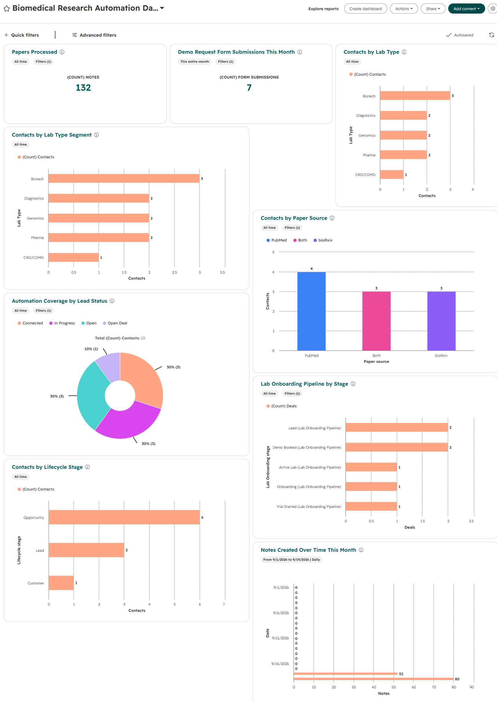
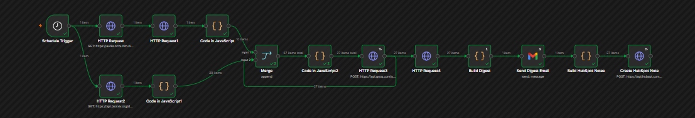

# lab-intel-pipeline

A scheduled automation pipeline that aggregates biomedical literature from PubMed and bioRxiv, summarizes each paper with an AI model, delivers a daily digest by email, and enriches HubSpot CRM contacts based on the paper's research category.

The orchestration layer is n8n. HubSpot handles CRM state, segmentation, and reporting. The two are connected via the HubSpot Private App API.

---

## What it does

**Literature ingestion**
Two parallel requests hit the PubMed E-utilities API and the bioRxiv API for papers published in a configurable date window. PubMed returns IDs first; a second call fetches full abstracts. bioRxiv returns structured JSON directly.

**Filtering and categorization**
A keyword filter removes papers outside the biomedical domain. Each paper that passes gets tagged with a lab type — Genomics, Pharma, Biotech, or Diagnostics — based on its subject category and abstract content. This tag drives downstream CRM routing.

**AI summarization**
Each paper gets a 2–3 sentence summary in plain prose via the Groq API (gpt-oss-20b). Reasoning effort is set low to avoid the model spending its token budget on internal chain-of-thought before producing visible output.

**CRM enrichment**
Based on the lab type tag, the pipeline finds the matching HubSpot contact and PATCHes their lead status to IN_PROGRESS. This is the automation signal — the contact record changes state because of external research activity, not because a person did something.

**Note creation and digest delivery**
A HubSpot note is created per paper — title, source, AI summary — attached to the relevant contact record. A Gmail node formats everything into a single daily digest grouped by source.

---

## Architecture

```
PubMed API ──────┐
                 ├──► Filter + Lab Type Mapping ──► Groq AI Summary
bioRxiv API ─────┘                                        │
                                              ┌───────────┼───────────┐
                                              ▼           ▼           ▼
                                       HubSpot        Gmail        HubSpot
                                     Contact PATCH    Digest        Notes
```

---

## HubSpot CRM layer

**Custom contact properties**
- Lab Type (Genomics / Pharma / Biotech / Diagnostics / CRO/CDMO)
- Instrument Count
- Research Focus
- Paper Source
- AI Summary Status
- Last Digest Sent
- Research Relevance Score

**Lab Onboarding Pipeline**
Lead → Demo Booked → Trial Started → Onboarding → Active Lab

**Segments**
Three active contact lists — Genomics Labs, Pharma Labs, Biotech Labs — filter automatically based on Lab Type.

**Intake form**
A published HubSpot form with lab-specific fields captures demo requests. Submissions land in the pipeline as new contacts.

**HubSpot dashboard**



Papers processed, notes created over time, contacts by lab type, pipeline stage distribution, automation coverage by lead status.

---

## n8n Workflow



---

## Stack

| Layer | Tool |
|---|---|
| Orchestration | n8n |
| Peer-reviewed literature | PubMed E-utilities API |
| Preprints | bioRxiv API |
| AI summarization | Groq (gpt-oss-20b) |
| Email | Gmail |
| CRM | HubSpot + Private App API |

---

## Setup

1. Import `workflow/lab-intel-pipeline.json` into n8n
2. Add credentials: Groq API key, Gmail OAuth2, HubSpot Private App token
3. Create the custom contact properties in HubSpot
4. Map your contact IDs to lab types in the Contact Update node
5. Set the Schedule trigger — default 08:00 daily
